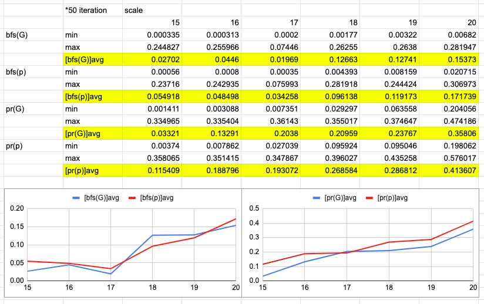

# csr

## About   
Serial & parallel csr graph implementation and dfs,bfs,pagerank on it.   
csr_serial.cpp : serial implementation.    
parallel_bfs.cpp : parallel bfs on csr.   
parallel_pagerank.cpp :  parallel pagerank on csr.   

parallel implementations are simplified version of [gapbs](https://github.com/sbeamer/gapbs)   

## How to run   
### serial   
    g++ -std=c++14 csr_serial.cpp -o serial.out   
    ./serial.out [input file path] [show graph (0/1)] [show result (0/1)] [iteration (0~9)]   

### parallel bfs   
    g++ -fopenmp -std=c++14 parallel_bfs.cpp -o bfs.out   
    ./bfs.out [input file path] [show graph (0/1)] [show result (0/1)] [iteration (0~9)]   

### parallel pagerank   
    g++ -fopenmp -std=c++14 parallel_pagerank.cpp -o pagerank.out   
    ./pagerank.out [input file path] [show graph (0/1)] [show result (0/1)] [iteration (0~9)]   

show graph: print each node line by line with its neighbors.   
show result: print the result of each algorithm.   
iteration: number of iteration for benchmark.   
    
## Result   

### Output Example: 10 vertices 30 edges   
    ./serial.out graphs/input.txt 1 1 1   

Node 0: 1 2 9    
Node 1: 2 3 4 8    
Node 2: 1 7 8    
Node 3: 0 1 4 5 8 9    
Node 4: 2 5 7    
Node 5:    
Node 6: 3 8    
Node 7: 1    
Node 8: 0 1 2 6    
Node 9: 0 2 5 6    

BFS result (from 0): 0 1 2 9 3 4 8 7 5 6    
DFS result (from 0): 0 1 2 7 8 6 3 4 5 9    
PageRank result (top 10): 1(0.198755) 2(0.148021) 8(0.144269) 3(0.089629) 7(0.083997) 0(0.075640) 4(0.075581) 5(0.066397) 6(0.062940) 9(0.054771)   

-Benchmark-   
BFS: 0.000012   
DFS: 0.000010   
PageRank: 0.000047   

### Benchmark    
Benchmark and comparison.    

*num node : 1024    
*10 iteration    
        					
avg degree of node | 2 | 10 | 100 | 200 | 500 | 1000   
---|---|---|---|---|---|---   
bfs (serial) | 0.00007 | 0.000119 | 0.000442 | 0.000802 | 0.00188 | 0.003661   
pagerank (serial) | 0.001302 | 0.001582 | 0.006739 | 0.01136 | 0.023237 | 0.027871   
dfs (serial) | 0.00009 | 0.000157 | 0.000662 | 0.001224 | 0.002888 | 0.005695   
bfs (parallel) | 0.00026 | 0.000162 | 0.000079 | 0.000086 | 0.000103 | 0.000111   
pagerank (parallel) | 0.00025 | 0.000349 | 0.000796 | 0.001584 | 0.00248 | 0.003124   
bfs (gapbs) | 0.00029 | 0.00024 | 0.00019 | 0.00017 | 0.00009 | 0.0001   
pagerank (gapbs) | 0.00036 | 0.00041 | 0.00024 | 0.0003 | 0.00036 | 0.00054   

